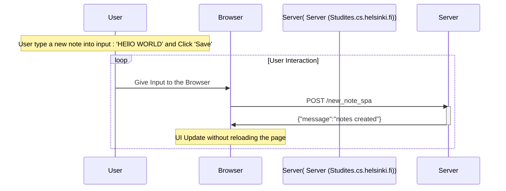

```mermaid
sequenceDiagram
    participant User
    participant Browser
    Participant Server( Server (Studites.cs.helsinki.fi))
    participant Server

    Note over User: User type a new note into input : 'HEllO WORLD' and Click 'Save'

    loop User Interaction
        User->>Browser: Give Input to the Browser
        Browser->>Server: POST /new_note_spa
        activate Server
        Server->>Browser: {"message":"notes created"}
        deactivate Server

        Note over Browser: UI Update without reloading the page
    end

```