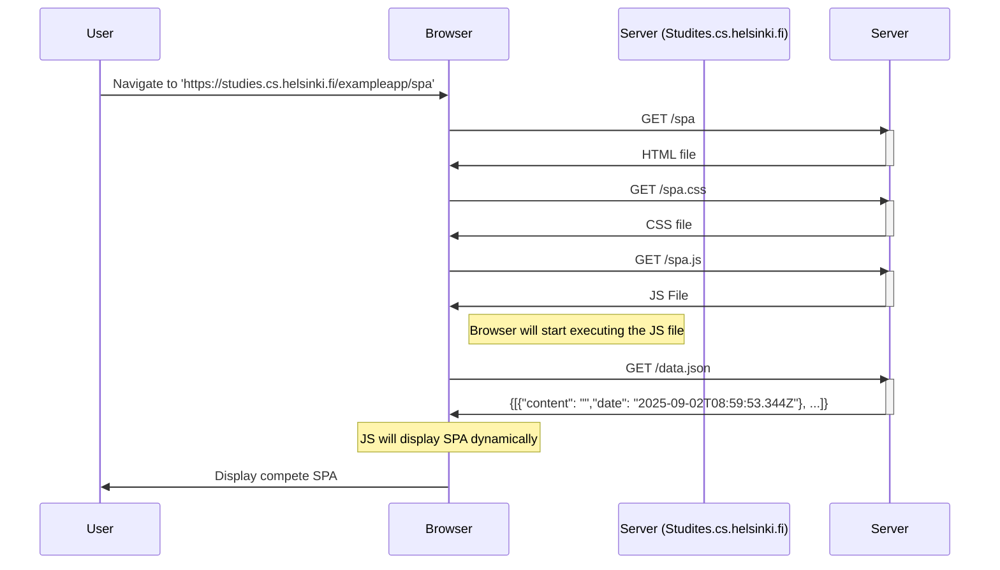

```mermaid
sequenceDiagram
    participant User
    participant Browser
    participant Server (Studites.cs.helsinki.fi)
    participant Server

    User->>Browser: Navigate to 'https://studies.cs.helsinki.fi/exampleapp/spa'

    Browser->>Server: GET /spa
    activate Server
    Server->>Browser: HTML file
    deactivate Server

    Browser->>Server: GET /spa.css
    activate Server
    Server->>Browser: CSS file
    deactivate Server

    Browser->>Server: GET /spa.js
    activate Server
    Server->>Browser: JS File
    deactivate Server

    Note right of Browser: Browser will start executing the JS file  

    Browser->>Server: GET /data.json
    activate Server
    Server->>Browser: {[{"content": "","date": "2025-09-02T08:59:53.344Z"}, ...]}
    deactivate Server

    Note over Browser: JS will display SPA dynamically

    Browser->>User: Display compete SPA 
```