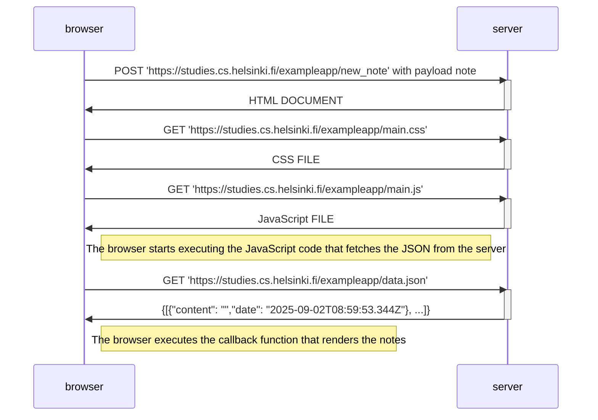

```mermaid
sequenceDiagram
    participant browser
    participant server

    browser->>server: POST 'https://studies.cs.helsinki.fi/exampleapp/new_note' with payload note 
    activate server
    server->>browser: HTML DOCUMENT
    deactivate server

    browser->>server: GET 'https://studies.cs.helsinki.fi/exampleapp/main.css'
    activate server
    server->>browser: CSS FILE
    deactivate server

    browser->>server: GET 'https://studies.cs.helsinki.fi/exampleapp/main.js'
    activate server
    server->>browser: JavaScript FILE
    deactivate server

    Note right of browser: The browser starts executing the JavaScript code that fetches the JSON from the server

    browser->>server: GET 'https://studies.cs.helsinki.fi/exampleapp/data.json'
    activate server
    server->>browser: {[{"content": "","date": "2025-09-02T08:59:53.344Z"}, ...]}
    deactivate server

    Note right of browser: The browser executes the callback function that renders the notes

```